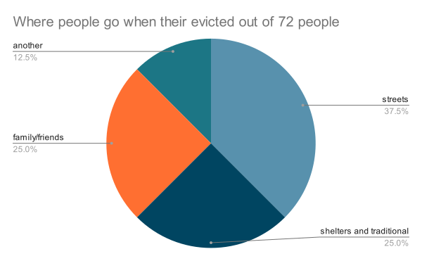

# Report

Everyone needs a warm place to sleep and rest. Unfortunately, not everyone has a home to feel safe. And some people even blame them for being homeless. But that’s not all, not having a home can make people likely to use drugs and be sick, which can cause missed school and job chances. And without school, it can be harder for people to make good decisions and get good jobs, which can lead to generational poverty. Luckily governments, businesses, and even people like me and you are helping out every day to end poverty.
	

 Unfortunately all that work isn’t enough to stop poverty in itself. In the USA between 2013 and 2020, 908,530 people entered homelessness, but only 900,895 left it. That means that homelessness is still growing,  like how in Vermont the homeless population that joined schools has more than doubled since 2019-2020. Which is especially bad since homelessness and poverty can make people more likely to abuse substances. It also means people have less healthcare and are more likely to have disorders, such as major depression disorder, which is twice as likely in homeless women than women with homes. In the end poverty is bad in small amounts, but is even worse since it’s still growing. 

Did you know that there is also a lot of homelessness in kids like you? An astronomical 1.6 million kids are homeless just in the United States, that’s 1 in every 45 kids. And almost as astonishing is that 16 million kids are in poverty. Closer to home, the percentage of homeless children in Vermont that have been fed has almost doubled from 2023 to 2024. And without enough money to live on, kids sometimes can’t go to school because they have to work to earn money. Now you know why homelessness isn’t just bad for adults, it’s also bad for kids.

Homelessness is a problem, and now you know why. And it can hurt anyone, from toddlers to grandparents. And every single one has suffered some kind of loss. Kids can’t go to school, parents can have disorders, and grandparents have less healthcare. And yes, it hurts everyone, but it always seems to focus on specific people, because of their race, gender, nationality, wealth, or even their disabilities. And that’s not chance, that is because of people, people that try to make it harder for other people to survive in this world. So if you really want a way to help, then don’t care what disabilities or differences someone might have, don’t think of homelessness as a crime. If someone is struggling to get a house in this world, you should do whatever you can to help them. You may think you need your money and other people's support, but they need it more.
